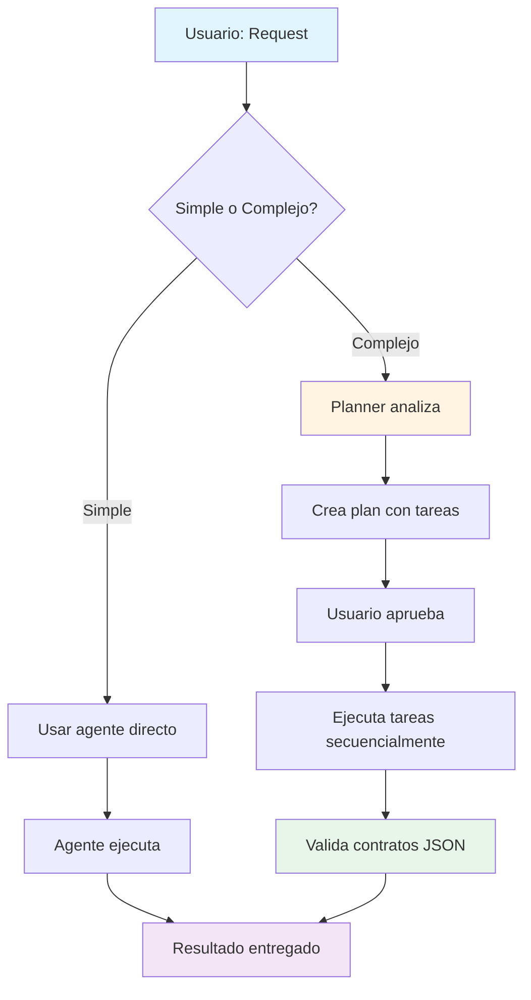

# 🤖 Sistema Multiagente - Quetzal Avalúo

## 📋 Resumen Ejecutivo

Este sistema define **6 perfiles especializados** que guían el desarrollo de Quetzal Avalúo. Cada perfil es un "sombrero" que el agente AI se pone para trabajar en áreas específicas del proyecto.

---

## 🎯 Los 6 Agentes

| Agente | Responsabilidad | Archivos Clave | Contratos JSON |
|--------|----------------|----------------|----------------|
| **🧠 Planner** | Coordinar y planificar | `task.md`, `implementation_plan.md` | `task_assignment`, `execution_plan` |
| **⚙️ agente_Workers** | APIs y lógica de negocio | `workers/*/src/index.js` | `avaluo_response`, `email_request` |
| **💬 agente_Prompts** | Prompts de AI | `workers/*/src/prompts/*.js` | `deepseek_prompt_structure` |
| **📊 agente_Tablas** | Tablas de comparables | `ComparablesTable.jsx`, `tables.css` | `comparable_item` |
| **📄 agente_Paginas** | Páginas y wizard | `Step*.jsx`, `Avaluo.jsx` | `form_data`, `wizard_state` |
| **🖨️ agente_PDF_correo** | PDFs y emails | `PDFDocument.jsx`, `email-*.html` | `pdf_props`, `email_data` |

---

## 🔄 Flujo de Trabajo



---

## 🎨 Casos de Uso

### ✨ Caso 1: Cambio Simple
```
Input: "Cambia el color del header de tabla a azul"
Agente: Frontend_Tables
Comando: Como Frontend_Tables, cambia el color...
Tiempo: ~5 min
```

### 🔧 Caso 2: Cambio Medio
```
Input: "Añade campo 'año_construccion' a comparables"
Agente: Planner coordina agente_Workers + agente_Tablas + agente_PDF_correo
Tiempo: ~45 min
Validación: Contrato comparable_item actualizado en todos lados
```

### 🚀 Caso 3: Feature Completo
```
Input: "Implementa filtros avanzados en comparables"
Agente: Planner coordina los 6 agentes
Plan: 4 tareas con dependencias
Tiempo: 2-3 horas
```

---

## 🔒 Contratos JSON Críticos

### `avaluo_response` (agente_Workers → Frontend)
```json
{
  "avaluo_id": "string (UUID)",
  "tipo_propiedad": "string",
  "precio_final_cop": "number",
  "comparables": [...],
  "metodos_valoracion": {...},
  "nivel_confianza": {...}
}
```

**Regla de oro**: Si agente_Workers cambia este contrato, TODOS los frontends deben actualizarse.

### `comparable_item` (Usado por Tablas, PDF, Email)
```json
{
  "titulo": "string",
  "precio_publicado": "number",
  "precio_m2": "number",
  "area_m2": "number"
}
```

**Validación**: agente_Tablas, agente_PDF_correo deben consumir exactamente esta estructura.

---

## 📝 Comandos Rápidos

| Qué quieres hacer | Comando |
|-------------------|---------|
| Planificar cambio grande | `Como Planner, ayúdame a implementar [feature]` |
| Cambio directo en backend | `Como agente_Workers, [tarea]` |
| Mejorar prompts AI | `Como agente_Prompts, [optimización]` |
| Cambio en tabla | `Como agente_Tablas, [cambio visual]` |
| Cambio en páginas | `Como agente_Paginas, [cambio de flujo]` |
| Fix en PDF | `Como agente_PDF_correo, [corrección]` |
| Diagnosticar problema | `Como Planner, diagnostica: [problema]` |
| Validar consistencia | `Valida contratos JSON` |

---

## ✅ Ventajas del Sistema

### 🎯 **Enfoque**: 
Cada agente tiene un scope claro, sin confusión.

### 🔐 **Seguridad**: 
Los contratos previenen cambios que rompen integraciones.

### 📈 **Escalabilidad**: 
Fácil añadir nuevos agentes para nuevas áreas.

### 🧪 **Testeable**: 
Cada perfil tiene requisitos de testing específicos.

### 📚 **Documentado**: 
Cada cambio queda trazado al perfil usado.

---

## 🚨 Reglas de Oro

| ✅ Hacer | ❌ No Hacer |
|---------|------------|
| Especificar qué agente usar | Mezclar responsabilidades |
| Validar contratos después de cambios | Romper contratos sin coordinación |
| Probar según requisitos del perfil | Saltarse validaciones |
| Coordinar cambios multi-agente | Tocar archivos `forbidden_actions` |
| Documentar qué perfil se usó | Ignorar dependencias entre agentes |

---

## 📂 Estructura de Archivos

```
.agent/
├── profiles/
│   ├── planner.json              ← 🧠 Orquestador
│   ├── agente_workers.json       ← ⚙️ APIs
│   ├── agente_prompts.json       ← 💬 Prompts AI
│   ├── agente_tablas.json        ← 📊 Tablas
│   ├── agente_paginas.json       ← 📄 Páginas
│   └── agente_pdf_correo.json    ← 🖨️ PDFs y Emails
├── orchestrator.md               ← 📖 Guía completa
├── examples.json                 ← 💡 Ejemplos prácticos
└── README.md                     ← 👋 Este archivo
```

---

## 🚀 Empezar

### 1️⃣ **Lee los perfiles**
Familiarízate con los 6 JSONs en `.agent/profiles/`

### 2️⃣ **Identifica tu necesidad**
¿Qué área del proyecto necesitas modificar?

### 3️⃣ **Usa el comando apropiado**
- Simple: `Como [Agente], [tarea]`
- Complejo: `Como Planner, ayúdame a [objetivo]`

### 4️⃣ **Valida**
Asegúrate que los contratos JSON se mantienen

---

## 📚 Recursos

- **Guía completa**: [`orchestrator.md`](./orchestrator.md)
- **Ejemplos prácticos**: [`examples.json`](./examples.json)
- **Perfiles detallados**: [`profiles/*.json`](./profiles/)

---

## ❓ FAQ

**P: ¿Son múltiples AIs trabajando en paralelo?**  
R: No, es un solo AI que cambia de contexto según el perfil.

**P: ¿Cómo se gestionan las dependencias?**  
R: El Planner crea un grafo de tareas y las ejecuta en orden.

**P: ¿Qué pasa si rompo un contrato?**  
R: El Planner detecta la inconsistencia antes de continuar.

**P: ¿Puedo crear nuevos agentes?**  
R: Sí, crea un nuevo JSON siguiendo la estructura existente.

---

## 🎯 Próximo Paso

**Prueba el sistema:**
```
Como Planner, muéstrame qué agente usarías para: 
"Añadir validación de email en el formulario"
```

---

**¿Listo para usar el sistema multiagente?** 🚀

Comienza con un comando simple o deja que el Planner te guíe.
